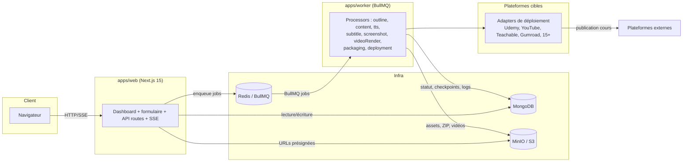

# SallyCourse

SaaS SALISTAR de génération automatique de cours : **titre + niveau → vidéos ordonnées, articles, TPs avec captures, quiz avec solutions**, déployables sur Udemy, YouTube, Teachable et 15+ plateformes.

## Architecture (monorepo pnpm)

```
apps/
  web/       Next.js 15 (App Router) — dashboard, formulaire, API, SSE
  worker/    Node BullMQ — génération (Claude), TTS, captures Playwright, rendu FFmpeg, déploiement
packages/
  shared/    Types + schémas Zod (source de vérité), constantes métier, storage S3
  db/        Modèles Mongoose
  design/    Design system SALISTAR : tokens (3 formats) + templates de rendu (slides/PDF/miniatures)
```

### Schéma de flux



Le worker consomme les jobs depuis Redis (BullMQ), persiste l'état dans Mongo
(`GenerationJob`, `Deployment`, …), lit/écrit les assets (vidéos, ZIP, miniatures)
dans MinIO/S3, puis délègue la publication finale à un adapter de plateforme
(`apps/worker/src/deploy/adapters/*.ts`, résolu via `deploy/registry.ts`).

Documentation complémentaire : `docs/DEPLOYMENT.md` (déploiement Hetzner),
`docs/ADDING-A-PLATFORM-ADAPTER.md` (ajouter une plateforme), `docs/RUNBOOK.md`
(incidents courants).

## Démarrage en 5 minutes

Prérequis : Docker Desktop (avec `docker compose` v2) et pnpm.

```bash
pnpm install                 # une seule fois
make setup                   # OU, sans make (Windows) : pnpm setup:local
```

`setup` est idempotent : il vérifie Docker, génère `.env` avec des secrets locaux
(AUTH_SECRET, CREDENTIALS_MASTER_KEY, clés S3), lance le profil `core`
(web, worker, mongo, redis, minio), attend le healthcheck Mongo, tente le seed,
puis affiche les URLs. Une fois lancé :

- Web : http://localhost:3000 · MinIO console : http://localhost:9001 · Mongo : `:27017`

Autres raccourcis : `pnpm up` / `pnpm up:full` (avec IA) / `pnpm down` / `pnpm logs` / `pnpm seed`.

## Environnement de dev

**Hot reload** — sur l'hôte (le plus rapide) : lancez l'infra puis les apps en watch.

```bash
pnpm up                                   # infra core (mongo/redis/minio) + web/worker
pnpm --filter @sallycourse/web dev        # next dev (HMR)
pnpm --filter @sallycourse/worker dev     # tsx watch
```

En conteneur, un overlay optionnel monte le code et bascule sur les commandes dev :

```bash
docker compose -f docker-compose.yml -f docker-compose.dev.yml --profile core up
```

**Outils de debug** (profil `debug`) :

```bash
docker compose --profile debug up -d
```

- mongo-express : http://localhost:8081 (login `admin` / `admin`)
- redis-commander : http://localhost:8082
- mailpit : http://localhost:8025 (SMTP `:1025` — pointer `SMTP_URL=smtp://mailpit:1025`)

**Mocks des APIs payantes** — `MOCK_PROVIDERS=true` évite déjà tout appel réseau.
Pour tester le chemin réseau avec de fausses clés, un serveur de mock local :

```bash
pnpm --filter @sallycourse/worker mock-server   # http://localhost:4010
```

Détails et variables `ANTHROPIC_BASE_URL` / `ELEVENLABS_BASE_URL` / `OPENAI_BASE_URL` :
`apps/worker/src/mocks/README.md`.

Roadmap complète : `SALLYCOURSE_250_PROMPTS.md` (250 prompts ordonnés, D1–D12 puis phases 1–14).
